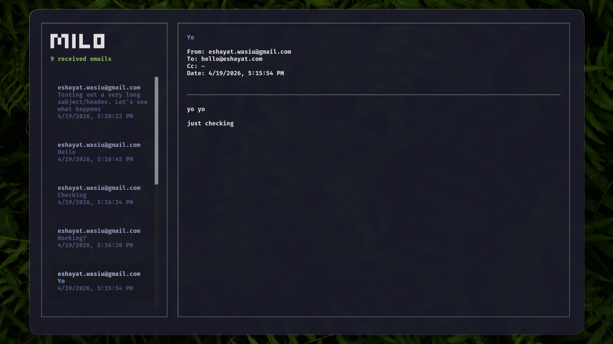

# Milo

A keyboard-first terminal email client for Resend.

Milo is a TUI inbox for reading received emails, searching through them, downloading attachments, replying, and composing new mail without leaving your terminal.

## Screenshot



## Install

```bash
bun i -g @esyt/milo
```

If you are working from source:

```bash
bun i
bun dev
```

## Setup

Milo uses Resend for inbox access and sending.

```bash
export RESEND_API_KEY="re_..."
export POP_FROM="you@yourdomain.com"
```

`RESEND_API_KEY` is required. `POP_FROM` is used as the sender for compose/reply flows and should be an address or domain verified in Resend.

## Usage

```bash
milo
```

## Features

- Read received emails from Resend.
- Navigate the inbox with arrow keys.
- Click inbox rows with the mouse.
- Search emails with `/`.
- Download received attachments to `~/Downloads`.
- Compose new emails with `n`.
- Reply to selected emails with `r`.
- Send email with `Ctrl-S`.
- Send outgoing attachments from local file paths.
- Refresh the inbox by clicking the Milo logo.
- Quit with `q`, `Esc`, or `Ctrl-C`.

## Keyboard Shortcuts

| Key                     | Action                                                         |
| ----------------------- | -------------------------------------------------------------- |
| `Up` / `Down`           | Move through the inbox                                         |
| `/`                     | Search emails                                                  |
| `Enter`                 | Open highlighted search result or download selected attachment |
| `n`                     | Compose a new email                                            |
| `r`                     | Reply to the selected email                                    |
| `a` or `i`              | Show received attachments                                      |
| `Tab` / `Shift-Tab`     | Move between compose/reply fields                              |
| `Ctrl-S` / `Ctrl-Enter` | Send compose/reply email                                       |
| `q`                     | Quit                                                           |
| `Esc`                   | Close modal or quit                                            |

## Attachments

When composing or replying, add attachments by entering comma-separated local file paths:

```text
~/Downloads/report.pdf, /tmp/screenshot.png
```

Milo reads the files locally, encodes them, and sends them with Resend.
